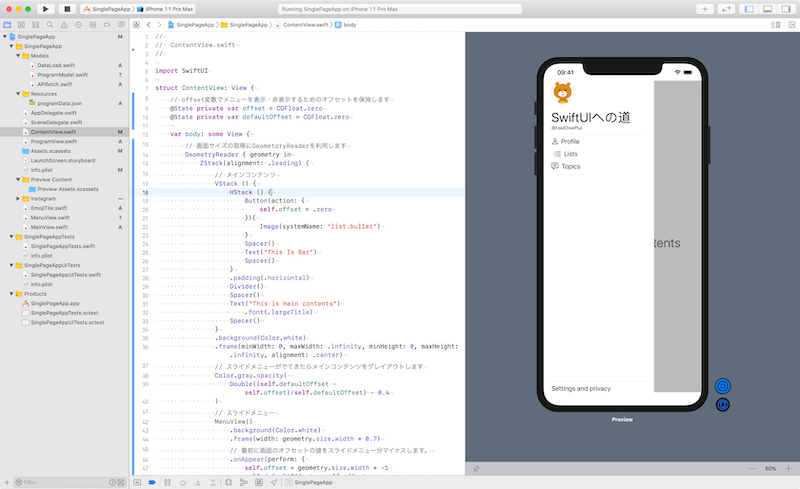
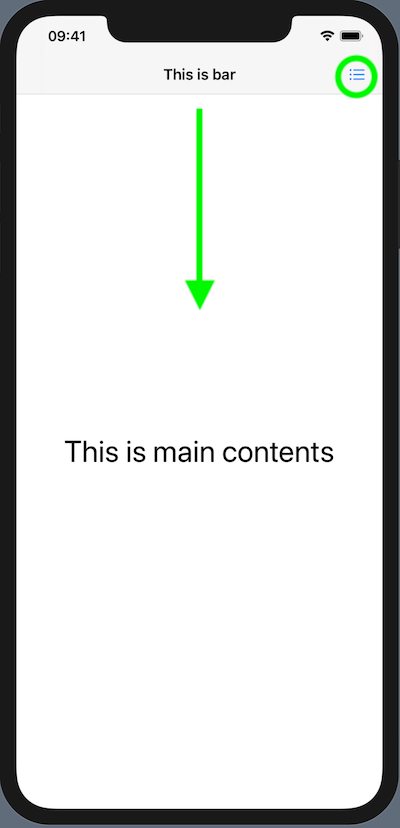
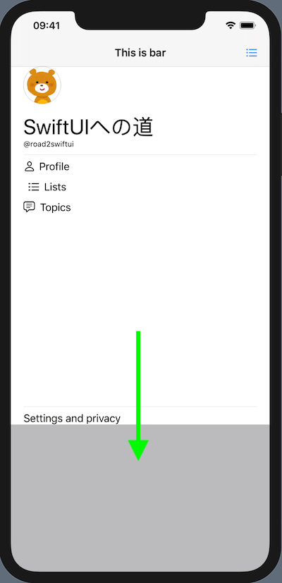
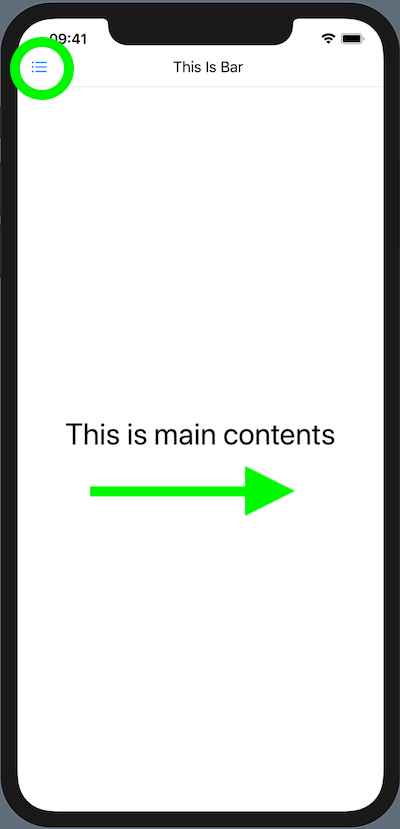
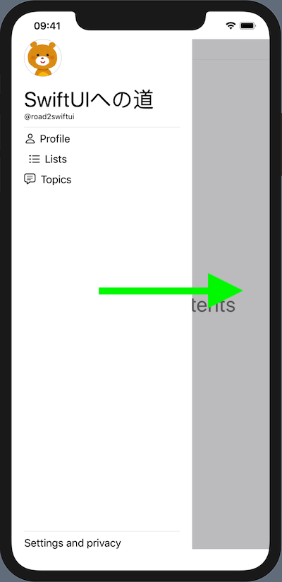
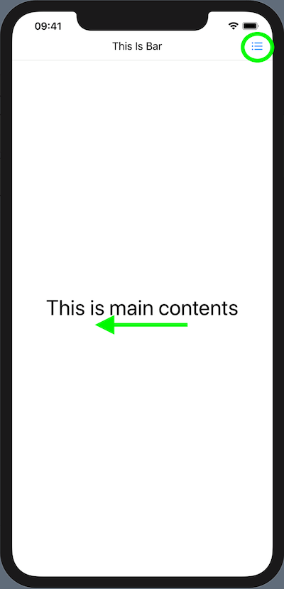
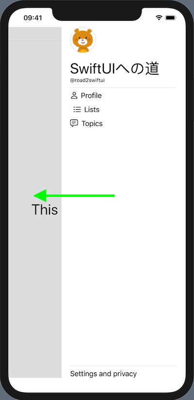

# Various Slide Menus
SlideMenus from Top, left(with NavigationView), Right

Detail description for this projects.
[上部左右から出現するメニューを作る](https://d1v1b.com/swiftui/various_slidemenu)

Use DragGesture to pull slide menus.

```swift
@State private var offset = CGFloat.zero
@State private var closeOffset = CGFloat.zero
@State private var openOffset = CGFloat.zero

... snip ...

.gesture(
    DragGesture(minimumDistance: 5)
        .onChanged{ value in
            self.offset = v.translation.width
        }
        .onEnded { value in
            if (value.translation.width > 0) {
                self.offset = self.openOffset
            } else {
                self.offset = self.closeOffset
            }
        }
)
```



## Top



## Left



## Right


